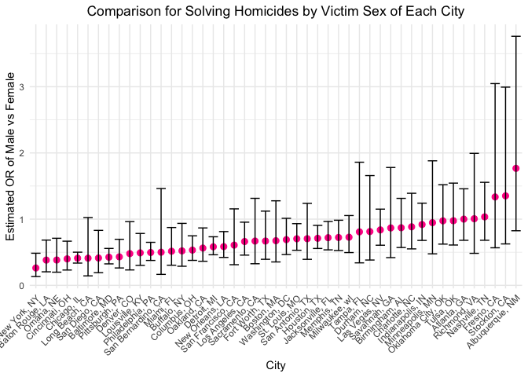
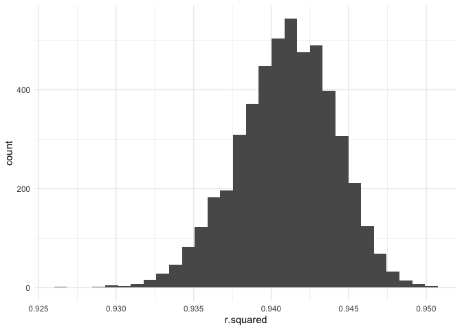
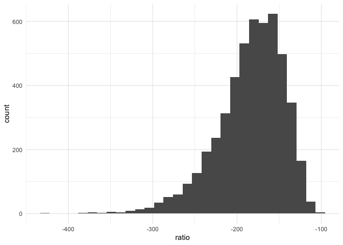
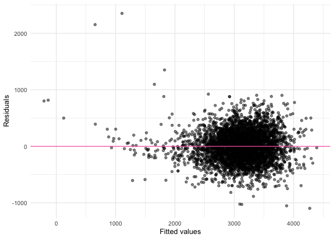

p8105_hw6_sy3352
================
Su Yan
2025-11-23

## Problem 1

``` r
homicides_df = read_csv("data/homicide-data.csv") |> 
  mutate(location = sprintf("%s, %s", city, state),
         solved = case_when(
           disposition == "Closed by arrest" ~ 1, TRUE ~ 0),
         victim_age = as.numeric(victim_age)
         ) |> 
  filter(!location %in% c("Dallas, TX", "Phoenix, AZ", 
                          "Kansas City, MO", "Tulsa, AL"),
         victim_race %in% c("Black", "White"))
```

    ## Rows: 52179 Columns: 12
    ## ── Column specification ────────────────────────────────────────────────────────
    ## Delimiter: ","
    ## chr (9): uid, victim_last, victim_first, victim_race, victim_age, victim_sex...
    ## dbl (3): reported_date, lat, lon
    ## 
    ## ℹ Use `spec()` to retrieve the full column specification for this data.
    ## ℹ Specify the column types or set `show_col_types = FALSE` to quiet this message.

    ## Warning: There was 1 warning in `mutate()`.
    ## ℹ In argument: `victim_age = as.numeric(victim_age)`.
    ## Caused by warning:
    ## ! NAs introduced by coercion

``` r
baltimore_df = homicides_df |> 
  filter(location == "Baltimore, MD")

baltimore_fit = baltimore_df |> 
  glm(solved ~ victim_age + victim_race + victim_sex, data = _, 
      family = binomial()) 

baltimore_results = baltimore_fit |> 
  broom::tidy(conf.int = TRUE, exponentiate = TRUE) |> 
  filter(term == "victim_sexMale") |>
  select(term, adjusted_OR = estimate, conf.low, conf.high, p.value) |> 
  knitr::kable(digits = 3)
baltimore_results
```

| term           | adjusted_OR | conf.low | conf.high | p.value |
|:---------------|------------:|---------:|----------:|--------:|
| victim_sexMale |       0.426 |    0.324 |     0.558 |       0 |

``` r
by_city = homicides_df |> 
  group_by(location) |> 
  nest() |> 
  mutate(glm_model = map(data, ~glm(solved ~ victim_age + victim_race + 
                                      victim_sex, data = .x, family = binomial()
  )),
  results = map(glm_model, ~broom::tidy(.x, conf.int = TRUE, 
                                        exponentiate = TRUE))) |> 
  select(location, results) |> 
  unnest(results) |> 
  filter(term == "victim_sexMale") |>
  select(location, adjusted_OR = estimate, conf.low, conf.high, p.value) 
```

    ## Warning: There were 43 warnings in `mutate()`.
    ## The first warning was:
    ## ℹ In argument: `results = map(glm_model, ~broom::tidy(.x, conf.int = TRUE,
    ##   exponentiate = TRUE))`.
    ## ℹ In group 1: `location = "Albuquerque, NM"`.
    ## Caused by warning:
    ## ! glm.fit: fitted probabilities numerically 0 or 1 occurred
    ## ℹ Run `dplyr::last_dplyr_warnings()` to see the 42 remaining warnings.

``` r
by_city_plot = by_city |> 
  ggplot(aes(x = reorder(location, adjusted_OR), y = adjusted_OR)) + 
  geom_point(color = "deeppink", size = 2.5) +
  geom_errorbar(aes(ymin = conf.low, ymax = conf.high)) + 
  theme(axis.text.x = element_text(angle = 45, hjust = 1), 
        plot.title = element_text(hjust = 0.5)) +
  labs(x = "City", y = "Estimated OR of Male vs Female",
       title = "Comparison for Solving Homicides by Victim Sex of Each City")
by_city_plot
```

<!-- -->

## Problem 2

``` r
boot_weather = weather_df |> 
  select(tmax, tmin, prcp) |> 
  modelr::bootstrap(n = 5000) |> 
  mutate(models = map(strap, \(df) lm(tmax ~ tmin + prcp, data = df)),
         results = map(models, broom::tidy),
         glances = map(models, broom::glance)) |> 
  select(-strap, -models) |> 
  unnest(glances, results)
```

    ## Warning: `unnest()` has a new interface. See `?unnest` for details.
    ## ℹ Try `df %>% unnest(c(glances, results))`, with `mutate()` if needed.

``` r
boot_results = boot_weather |> 
  select(.id, r.squared, term, estimate) |> 
  pivot_wider(names_from = term, values_from = estimate) |> 
  mutate(ratio = tmin/prcp)

boot_r_plot = boot_results |> 
  ggplot(aes(x = r.squared)) +
  geom_histogram()
boot_r_plot
```

    ## `stat_bin()` using `bins = 30`. Pick better value with `binwidth`.

<!-- -->

``` r
boot_ratio_plot = boot_results |> 
  ggplot(aes(x = ratio)) +
  geom_histogram()
boot_ratio_plot
```

    ## `stat_bin()` using `bins = 30`. Pick better value with `binwidth`.

<!-- -->

``` r
boot_ci = boot_results |> 
  summarize(
    r.squared_lower = quantile(r.squared, 0.025), 
    r.squared_upper = quantile(r.squared, 0.975),
    ratio_lower = quantile(ratio, 0.025), 
    ratio_upper = quantile(ratio, 0.975)) |> 
  knitr::kable(digits = 3)
boot_ci
```

| r.squared_lower | r.squared_upper | ratio_lower | ratio_upper |
|----------------:|----------------:|------------:|------------:|
|           0.934 |           0.947 |    -279.749 |    -125.686 |

## Problem 3

``` r
bwt_df = read_csv("data/birthweight.csv") |> 
  drop_na() |> 
  rename(
    head_cm = bhead, length_cm = blength, mother_wt_deliver = delwt, 
    income_hundreds = fincome, father_race = frace, gestation_week = gaweeks,
    mother_age_mensrche = menarche, mother_height = mheight, 
    mother_age_delivery = momage, mother_race = mrace, previous_lbw_n = pnumlbw,
    previous_small_ges_n = pnumsga, mother_prepreg_bmi = ppbmi, 
    mother_prepreg_wt = ppwt, cig_smoked_n = smoken, mother_wt_gain = wtgain
  ) |> 
  mutate(
    babysex = factor(babysex, levels = c(1,2), labels = c("male", "female")),
    father_race = factor(father_race),
    mother_race = factor(mother_race),
    malform = factor(malform, levels = c(0,1), labels = c("absent", "present"))
  ) 
```

    ## Rows: 4342 Columns: 20
    ## ── Column specification ────────────────────────────────────────────────────────
    ## Delimiter: ","
    ## dbl (20): babysex, bhead, blength, bwt, delwt, fincome, frace, gaweeks, malf...
    ## 
    ## ℹ Use `spec()` to retrieve the full column specification for this data.
    ## ℹ Specify the column types or set `show_col_types = FALSE` to quiet this message.

``` r
proposed_model = bwt_df |> 
  lm(bwt ~ babysex + head_cm + length_cm + mother_wt_deliver + income_hundreds +
       father_race + mother_race + mother_height + mother_age_delivery +
       mother_prepreg_bmi + cig_smoked_n + mother_wt_gain + gestation_week, 
     data = _)
summary(proposed_model)
```

    ## 
    ## Call:
    ## lm(formula = bwt ~ babysex + head_cm + length_cm + mother_wt_deliver + 
    ##     income_hundreds + father_race + mother_race + mother_height + 
    ##     mother_age_delivery + mother_prepreg_bmi + cig_smoked_n + 
    ##     mother_wt_gain + gestation_week, data = bwt_df)
    ## 
    ## Residuals:
    ##      Min       1Q   Median       3Q      Max 
    ## -1097.46  -184.34    -3.88   173.45  2351.98 
    ## 
    ## Coefficients:
    ##                       Estimate Std. Error t value Pr(>|t|)    
    ## (Intercept)         -6281.3207   659.3753  -9.526  < 2e-16 ***
    ## babysexfemale          29.3063     8.4645   3.462 0.000541 ***
    ## head_cm               130.8581     3.4527  37.901  < 2e-16 ***
    ## length_cm              74.9368     2.0218  37.065  < 2e-16 ***
    ## mother_wt_deliver       0.6729     2.5833   0.260 0.794515    
    ## income_hundreds         0.2860     0.1792   1.596 0.110568    
    ## father_race2           12.9229    46.1570   0.280 0.779508    
    ## father_race3           19.4755    69.3215   0.281 0.778766    
    ## father_race4          -49.1603    44.6745  -1.100 0.271215    
    ## father_race8            3.2709    74.1043   0.044 0.964795    
    ## mother_race2         -150.5937    46.0630  -3.269 0.001087 ** 
    ## mother_race3          -93.5611    71.9434  -1.300 0.193505    
    ## mother_race4          -55.8736    45.1521  -1.237 0.215986    
    ## mother_height           9.4318    10.3144   0.914 0.360540    
    ## mother_age_delivery     0.6932     1.1970   0.579 0.562513    
    ## mother_prepreg_bmi      4.3008    14.8909   0.289 0.772733    
    ## cig_smoked_n           -4.8730     0.5870  -8.301  < 2e-16 ***
    ## mother_wt_gain          3.4782     2.6127   1.331 0.183173    
    ## gestation_week         11.2650     1.4611   7.710 1.55e-14 ***
    ## ---
    ## Signif. codes:  0 '***' 0.001 '**' 0.01 '*' 0.05 '.' 0.1 ' ' 1
    ## 
    ## Residual standard error: 272.6 on 4323 degrees of freedom
    ## Multiple R-squared:  0.7179, Adjusted R-squared:  0.7167 
    ## F-statistic: 611.1 on 18 and 4323 DF,  p-value: < 2.2e-16

``` r
bwt_df_predict = bwt_df |> 
  modelr::add_predictions(proposed_model) |> 
  modelr::add_residuals(proposed_model)

bwt_predict_pt = bwt_df_predict |> 
  ggplot(aes(x = pred, y = resid)) +
  geom_point(alpha = 0.5) +
  geom_hline(yintercept = 0, color = "hotpink") +
  labs(x = "Fitted values", y = "Residuals")
bwt_predict_pt
```

<!-- --> I
evaluated model assumptions using a residuals vs fitted plot generated
with `add_predictions()` and `add_residuals()`. The plot shows a roughly
elliptical cloud of points centered around zero with no strong pattern
or evidence of nonlinearity. The variance of residuals is approximately
constant across fitted values. These diagnostics suggest that the linear
model assumptions are reasonably satisfied.

``` r
model_main_effects = bwt_df |> 
  lm(bwt ~ length_cm + gestation_week, data = _)
summary(model_main_effects)
```

    ## 
    ## Call:
    ## lm(formula = bwt ~ length_cm + gestation_week, data = bwt_df)
    ## 
    ## Residuals:
    ##     Min      1Q  Median      3Q     Max 
    ## -1709.6  -215.4   -11.4   208.2  4188.8 
    ## 
    ## Coefficients:
    ##                 Estimate Std. Error t value Pr(>|t|)    
    ## (Intercept)    -4347.667     97.958  -44.38   <2e-16 ***
    ## length_cm        128.556      1.990   64.60   <2e-16 ***
    ## gestation_week    27.047      1.718   15.74   <2e-16 ***
    ## ---
    ## Signif. codes:  0 '***' 0.001 '**' 0.01 '*' 0.05 '.' 0.1 ' ' 1
    ## 
    ## Residual standard error: 333.2 on 4339 degrees of freedom
    ## Multiple R-squared:  0.5769, Adjusted R-squared:  0.5767 
    ## F-statistic:  2958 on 2 and 4339 DF,  p-value: < 2.2e-16

``` r
model_interaction = bwt_df |> 
  lm(bwt ~ (head_cm + length_cm + babysex)^3, data = _)
summary(model_interaction)
```

    ## 
    ## Call:
    ## lm(formula = bwt ~ (head_cm + length_cm + babysex)^3, data = bwt_df)
    ## 
    ## Residuals:
    ##      Min       1Q   Median       3Q      Max 
    ## -1132.99  -190.42   -10.33   178.63  2617.96 
    ## 
    ## Coefficients:
    ##                                   Estimate Std. Error t value Pr(>|t|)    
    ## (Intercept)                     -7176.8170  1264.8397  -5.674 1.49e-08 ***
    ## head_cm                           181.7956    38.0542   4.777 1.84e-06 ***
    ## length_cm                         102.1269    26.2118   3.896 9.92e-05 ***
    ## babysexfemale                    6374.8684  1677.7669   3.800 0.000147 ***
    ## head_cm:length_cm                  -0.5536     0.7802  -0.710 0.478012    
    ## head_cm:babysexfemale            -198.3932    51.0917  -3.883 0.000105 ***
    ## length_cm:babysexfemale          -123.7729    35.1185  -3.524 0.000429 ***
    ## head_cm:length_cm:babysexfemale     3.8781     1.0566   3.670 0.000245 ***
    ## ---
    ## Signif. codes:  0 '***' 0.001 '**' 0.01 '*' 0.05 '.' 0.1 ' ' 1
    ## 
    ## Residual standard error: 287.7 on 4334 degrees of freedom
    ## Multiple R-squared:  0.6849, Adjusted R-squared:  0.6844 
    ## F-statistic:  1346 on 7 and 4334 DF,  p-value: < 2.2e-16

``` r
cv_df = modelr::crossv_mc(bwt_df, 50) |> 
  mutate(
    train = map(train, as_tibble),
    test = map(test, as_tibble)
  )

cv_df_fit = cv_df |> 
  mutate(
    main_effect_mod = map(train, \(df) lm(bwt ~ length_cm + gestation_week, data = df)),
    interact_mod = map(train, \(df) lm(bwt ~ (head_cm + length_cm + babysex)^3, data = df))
  ) |> 
  mutate(
    rmse_main_effect = map2_dbl(main_effect_mod, test, \(mod, df) 
      sqrt(mean((df$bwt - predict(mod, newdata = df))^2))
    ),
    rmse_interact = map2_dbl(interact_mod, test, \(mod, df) 
      sqrt(mean((df$bwt - predict(mod, newdata = df))^2))
    )
  )

cv_df_results = cv_df_fit |> 
  summarize(
    mean_rmse_main_effect = mean(rmse_main_effect),
    mean_rmse_interact = mean(rmse_interact),
    sd_rmse_main_effect = sd(rmse_main_effect),
    sd_rmse_interact = sd(rmse_interact)
  )
cv_df_results
```

    ## # A tibble: 1 × 4
    ##   mean_rmse_main_effect mean_rmse_interact sd_rmse_main_effect sd_rmse_interact
    ##                   <dbl>              <dbl>               <dbl>            <dbl>
    ## 1                  332.               290.                13.1             8.75
